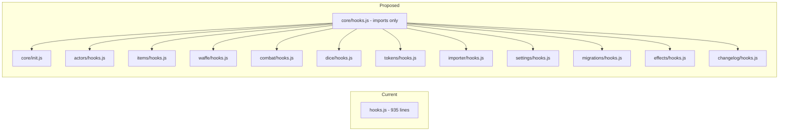
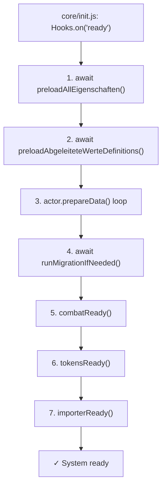
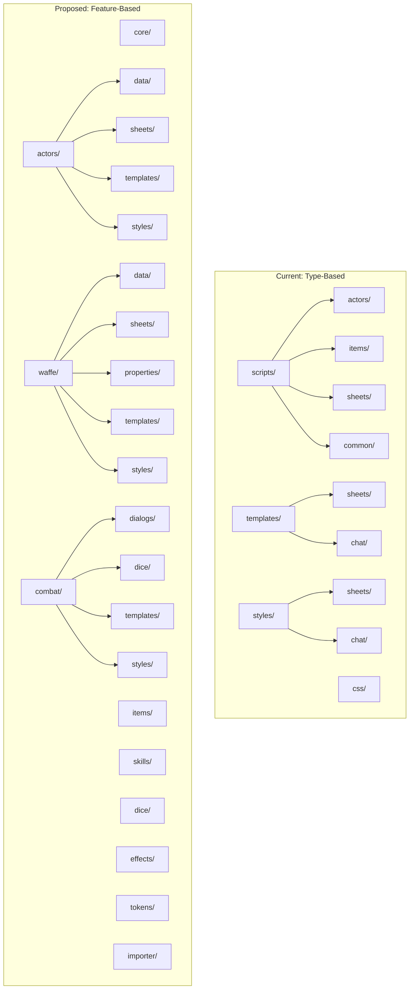

# Feature-Based Folder Restructure for IlarisFoundryVTT

## Current Structure (type-based)

Code is split across three top-level folders by technical type:

- `scripts/` -- all JavaScript (actors, items, sheets, common, hooks, etc.)
- `templates/` -- all Handlebars templates (sheets, chat, dialogs, settings, etc.)
- `styles/` -- all CSS (sheets, dialogs, chat)

This means related files (e.g., the combat dialog JS, its template, and its CSS) live in completely different directory trees.

The monolithic `scripts/hooks.js` (935 lines) mixes concerns from every feature domain: actor/item registration, status effects, import UI buttons, hex token shapes, settings UI customization, socket handling, dice formatting, and more.

## Decomposing hooks.js

The current `scripts/hooks.js` is split into **per-feature hook files**. Each feature registers its own Foundry hooks (`Hooks.once('init', ...)`, `Hooks.on(...)`, etc.). The main entry point becomes a slim orchestrator.

**Note:** There is a duplicate `getSceneControlButtons` hook (lines 359-371 and 490-502 in the current file are identical). This will be deduplicated during the split.

### New main entry point: `scripts/core/hooks.js`

A slim file that only imports feature hooks (no logic of its own):

```js
// Core initialization (CONFIG, handlebars, document classes)
import './init.js'

// Feature hooks
import '../actors/hooks.js'
import '../items/hooks.js'
import '../waffe/hooks.js'
import '../combat/hooks.js'
import '../dice/hooks.js'
import '../effects/hooks.js'
import '../tokens/hooks.js'
import '../importer/hooks.js'
import '../settings/hooks.js'
import '../migrations/hooks.js'
import '../changelog/hooks.js'
```

### `scripts/core/init.js` -- Core system bootstrap

Extracted from `Hooks.once('init', ...)` -- only system-wide concerns:

- `CONFIG.Actor.documentClass`, `CONFIG.ActiveEffect.documentClass`, `CONFIG.Item.documentClass`
- `initializeHandlebars()`
- `CONFIG.ILARIS = ILARIS`
- `CONFIG.Combat.initiative`
- `registerIlarisGameSettings()`

### Per-feature hooks (what moves where)

- `**actors/hooks.js**`: `Actors.unregisterSheet` + `registerSheet` calls (`init`), export `export function actorsReady() {}` for sequential calling
- `**items/hooks.js**`: `Items.unregisterSheet` + non-weapon item `registerSheet` calls (`init`)
- `**waffe/hooks.js**`: Weapon-specific `Items.unregisterSheet` + `registerSheet` calls for nahkampfwaffe, fernkampfwaffe, waffeneigenschaft (`init`)
- `**combat/hooks.js**`: `CONFIG.statusEffects` (`init`), defense prompt in `renderChatMessage`, `renderTokenHUD` tinting. Export `export function combatReady() { registerDefenseButtonHook(); setupIlarisSocket(); }` for sequential calling from `core/init.js`
- `**dice/hooks.js**`: Dice formula formatting in `renderChatMessage`
- `**tokens/hooks.js**`: Hex token `drawToken`/`refreshToken`/`updateSetting` hooks. Export `export function tokensReady() { applyHexTokenSetting(); }` for sequential calling from `core/init.js`
- `**importer/hooks.js**`: `getSceneControlButtons` (deduplicated), `renderActorDirectory`, `renderCompendiumDirectory`. Export `export function importerReady() {}` for sequential calling
- `**settings/hooks.js**`: `renderSettingsConfig`, `renderSceneConfig`
- `**migrations/hooks.js**`: `worldSchemaVersion` registration (`init`)
- `**effects/hooks.js**`, `**changelog/hooks.js**`: Already exist as separate files, just relocate

### Async `ready` hook -- ordering safety & sequential orchestration

FoundryVTT does **not** `await` async hook callbacks. When `Hooks.callAll('ready')` fires, each async listener starts concurrently. The current `ready` hook has a critical ordering dependency:

```
preloadAllEigenschaften()              -- must complete before
preloadAbgeleiteteWerteDefinitions()   -- must complete before
actor.prepareData() loop               -- depends on both caches
runMigrationIfNeeded()                 -- depends on caches
```

**Additionally**, all feature-specific `ready` logic (defense button setup, socket initialization, hex token settings) must run **sequentially after** the core cache+migration chain completes, not concurrently.

**Solution:** Keep a single `ready` orchestrator in `core/init.js` that runs ALL ready logic sequentially in one callback:

```js
// core/init.js -- ordered async startup (MUST stay together)
// Imports preloadAllEigenschaften from waffe/ module
import { preloadAllEigenschaften } from '../waffe/properties/utils/eigenschaft-cache.js'
import { preloadAbgeleiteteWerteDefinitions } from '../actors/actor.js' // stays in actor.js
import { runMigrationIfNeeded } from '../migrations/migrate-waffen-eigenschaften.js'

// Import feature-specific ready callbacks (defined in feature hooks.js files)
import { combatReady } from '../combat/hooks.js'
import { tokensReady } from '../tokens/hooks.js'
import { importerReady } from '../importer/hooks.js'

Hooks.on('ready', async () => {
    // 1. Core cache preload (critical ordering)
    await preloadAllEigenschaften()
    await preloadAbgeleiteteWerteDefinitions()

    // 2. Actor preparation
    for (const actor of game.actors) {
        actor.prepareData()
    }

    // 3. Data migrations
    await runMigrationIfNeeded()

    // 4. Feature-specific ready logic (sequential)
    combatReady()
    tokensReady()
    importerReady()
})
```

Each feature's ready logic is extracted into a named export (e.g., `export function combatReady() { ... }` in `combat/hooks.js`) and called sequentially from the main orchestrator.

**Note:** `preloadAbgeleiteteWerteDefinitions()` remains in `scripts/actors/actor.js` (not extracted to separate file).

## Proposed Folder Structure (feature-based)

Each **feature domain** co-locates its scripts, templates, styles, and tests. The top-level `scripts/` directory becomes the root for all feature modules. The standalone `templates/` and `styles/` directories are dissolved -- their contents move into feature folders.

### Waffe Feature Extraction

Weapons (nahkampfwaffe, fernkampfwaffe, waffeneigenschaft) and their complex property system (eigenschaften) are extracted from the generic `items/` feature into their own `waffe/` feature. This separation is justified by:

- **Complexity**: The weapon property system (eigenschaft processors, parsers, cache) is substantial and distinct from other item types
- **Domain coherence**: Weapons have unique behavior (wielding, target effects, actor modifiers) not shared by other items like talents, skills, or maneuvers
- **Migration needs**: Weapon-specific data migrations (waffen-migration.js) are co-located with weapon code
- **Settings**: Weapon and weapon property pack settings are distinct from other item settings

```
scripts/
  core/                          # System bootstrap, config, shared utilities
    hooks.js                     # NEW: slim main entry, only imports feature hooks
    init.js                      # NEW: extracted core init (CONFIG, handlebars, settings)
    config.js                    # (was scripts/config.js)
    config/
      label.js
    handlebars.js                # (was scripts/common/handlebars.js)
    utilities.js                 # (was scripts/common/utilities.js)
    _spec/
      handlebars.spec.js
      utilities.spec.js

  actors/                        # Hero, creature, NPC actors and sheets
    hooks.js                     # NEW: actor sheet registration
    data/
      actor.js                   # (was scripts/actors/actor.js)
      held.js
      kreatur.js
      proxy.js
      hardcodedvorteile.js
      actor-weapon-utils.js              # (was scripts/actors/weapon-utils.js)
    sheets/
      actor.js                   # (was scripts/sheets/actor.js)
      held.js                  # (was scripts/sheets/helden.js) renamed from helden.js
      kreatur.js                 # (was scripts/sheets/kreatur.js)
    templates/
      kreatur.hbs
      held/                      # (was templates/sheets/tabs/*) PARTS and TABS in sheets/held.js
        header.hbs
        navigation.hbs
        sidebar.hbs
        attribute.hbs
        auslagerung.hbs
        effekte.hbs
        fertigkeiten.hbs
        inventar.hbs
        kampf.hbs
        notes.hbs
        uebernatuerlich.hbs
        carrying.hbs
        finances.hbs
        handcart.hbs
        supporting.hbs
    _spec/
      hardcodedvorteile.test.js
      actor-weapon-utils.test.js        # tests from (was weapon-utils.test.js)

  items/                         # Non-weapon item types and sheets
    hooks.js                     # NEW: item sheet registration
    data/
      item.js                    # (was scripts/items/item.js)
      angriff.js
      combat-item.js                   # renamed from combat.js (was scripts/items/combat.js)
      effect-item.js
      manoever.js
      proxy.js
    sheets/
      item.js                    # (was scripts/sheets/items/item.js)
      ruestung.js
      fertigkeit.js
      talent.js
      vorteil.js
      manoever.js
      gegenstand.js
      uebernatuerlich_fertigkeit.js
      uebernatuerlich_talent.js
      freie_fertigkeit.js
      freies_talent.js
      eigenheit.js
      eigenschaft.js
      abgeleiteter-wert.js
      angriff.js
      effect-item.js
      info.js
    templates/                   # (was templates/sheets/items/*)
      base_item_layout.hbs
      ruestung.hbs
      fertigkeit.hbs
      talent.hbs
      vorteil.hbs
      manoever.hbs
      gegenstand.hbs
      ... (non-weapon item templates)
    styles/
      manoever.css               # (was styles/sheets/manoever.css)
    _spec/
      manoever.spec.js
      combat.spec.js

  waffe/                         # Weapons (Nahkampfwaffe, Fernkampfwaffe) and weapon properties
    hooks.js                     # NEW: weapon sheet registration
    data/
      waffe.js                   # (was scripts/items/waffe.js)
    sheets/
      waffe.js                   # renamed from waffe-base.js (was scripts/sheets/items/waffe-base.js)
      nahkampfwaffe.js           # (was scripts/sheets/items/nahkampfwaffe.js)
      fernkampfwaffe.js          # (was scripts/sheets/items/fernkampfwaffe.js)
      waffeneigenschaft.js       # (was scripts/sheets/items/waffeneigenschaft.js)
    properties/
      processors/                # (was scripts/items/eigenschaft-processors/*)
        base-processor.js
        modifier-processor.js
        wielding-processor.js
        target-effect-processor.js
        actor-modifier-processor.js
        passive-processor.js
        processor-factory.js
      utils/                     # (was scripts/items/utils/*)
        eigenschaft-cache.js
        eigenschaft-parser.js
        eigenschaft-utils.js
    migrations/
      migrate-waffen-eigenschaften.js  # (was scripts/migrations/migrate-waffen-eigenschaften.js)
      waffen-migration.js              # (was scripts/common/waffen-migration.js)
      waffen-migration-hook.js         # (was scripts/hooks/waffen-migration.js)
    templates/                   # (was templates/sheets/items/*)
      nahkampfwaffe.hbs
      fernkampfwaffe.hbs
      waffeneigenschaft.hbs
    styles/
      waffe.css                  # weapon-specific styles
    _spec/
      waffe.spec.js
      combat.spec.js
      eigenschaft-cache.spec.js
      eigenschaft-parser.test.js
      eigenschaft-utils.spec.js
      modifier-processor.spec.js
      processor-factory.spec.js
      target-effect-processor.spec.js
      wielding-processor.spec.js

  combat/                        # Combat system: attacks, defense, melee, ranged
    hooks.js                     # NEW: status effects, defense prompt, socket, token HUD tint
    dialogs/
      angriff.js                 # (was scripts/sheets/dialogs/angriff.js)
      combat_dialog.js
      dialog_nahkampf.js
      fernkampf_angriff.js
      defense_button_hook.js
      target_selection.js
      shared_dialog_helpers.js
      uebernatuerlich.js
    dice/
      nahkampf_prepare.js        # (was scripts/common/wuerfel/nahkampf_prepare.js)
      fernkampf_prepare.js
    templates/
      dialogs/
        angriff.hbs              # (was templates/sheets/dialogs/angriff.hbs)
        fernkampf_angriff.hbs
        target_selection.hbs
        uebernatuerlich.hbs       # from templates/dialogs/uebernatuerlich.bhs
      chat/
        probendiag_at.hbs        # delete! # (was templates/chat/probendiag_at.hbs)
        probendiag_nahkampf.hbs # delete!
        probendiag_fernkampf.hbs # delete!
        probendiag_attribut.hbs # delete!
    styles/
      defense-prompt.css         # (was styles/chat/defense-prompt.css)
    _spec/
      shared_dialog_helpers.test.js
      uebernatuerlich.spec.js
      verbotene_pforten.spec.js

  skills/                        # Skill/talent probes and supernatural checks
    dialogs/
      fertigkeit.js              # (was scripts/sheets/dialogs/fertigkeit.js)
    dice/
      magie_prepare.js           # (was scripts/common/wuerfel/magie_prepare.js)
      karma_prepare.js
    templates/
      dialogs/
        fertigkeit.hbs           # (was templates/sheets/dialogs/fertigkeit.hbs)
      chat/
        probenchat_profan.hbs    # (was templates/chat/probenchat_profan.hbs)
        probendiag_profan.hbs     # delete!
        probendiag_magie.hbs      # delete!
        probendiag_karma.hbs      # delete!
        probendiag_simpleformula.hbs  # delete!

  dice/                          # Shared dice rolling utilities
    hooks.js                     # NEW: dice formula formatting in renderChatMessage
    chatutilities.js             # (was scripts/common/wuerfel/chatutilities.js)
    wuerfel_misc.js
    templates/
      dreid20.hbs                # (was templates/chat/dreid20.hbs)
      spell_cost.hbs
      spell_result.hbs
      yesno.hbs                 # delete!
    _spec/
      wuerfel_misc.spec.js

  effects/                       # Active effects, DOT, status effects
    hooks.js                     # (was scripts/hooks/active-effects.js + dot-effects.js)
    active-effects.js
    dot-effects.js
    effects-manager.js           # (was scripts/sheets/common/effects-manager.js)
    templates/
      effects-section.hbs        # (was templates/helper/effects-section.hbs)

  tokens/                        # Hex token shapes and token display
    hooks.js                     # NEW: drawToken, refreshToken, updateSetting + all hex mask logic

  importer/                      # XML/Sephrasto import
    hooks.js                     # NEW: getSceneControlButtons, renderActorDirectory, renderCompendiumDirectory
    sephrasto_importer.js        # (was scripts/common/sephrasto_importer.js)
    xml-character-import-dialogs.js
    xml_character_importer.js
    xml_rule_importer/
      ... (same sub-structure)
    templates/
      rule-import-dialog.hbs     # (was templates/importer/rule-import-dialog.hbs)

  settings/                      # Game settings rework to settings dialog planned
    hooks.js                     # NEW: renderSettingsConfig + renderSceneConfig hooks
    configure-game-settings.js
    configure-game-settings.model.js
    *PacksSettings.js
    index.js
    templates/                   # (was templates/settings/*)
      abgeleitete-werte-packs.hbs
      fertigkeiten-packs.hbs
      maneuver-packs.hbs
      scene_environment_fields.hbs
      talente-packs.hbs
      vorteile-packs.hbs
      waffen-packs.hbs           # weapon pack settings (related to waffe feature)
      waffeneigenschaften-packs.hbs  # weapon property pack settings (related to waffe feature)

  migrations/                    # Data migrations (general system migrations)
    hooks.js                     # NEW: worldSchemaVersion registration + runMigrationIfNeeded on ready

  changelog/                     # Release notes / breaking changes
    hooks.js                     # (was scripts/hooks/changelog-notification.js, already self-contained)
    templates/
      breaking-changes-12.3.hbs  # (was templates/changes/breaking-changes-12.3.hbs)
    styles/
      changelog-notification.css # (was styles/dialogs/changelog-notification.css)
```

**Unchanged top-level directories** (not source code features):

- `assets/` -- static images, fonts, icons
- `comp_packs/` -- compendium pack data (2000+ JSON files)
- `docs/` -- documentation
- `utils/` -- build/utility scripts

**Deleted directories:**

- `local_db/` -- removed (no longer needed)
- `css/` -- dissolved; `temp.css` is split into per-feature CSS files (see below)
- `templates/` -- dissolved; contents moved into feature `templates/` sub-folders
- `styles/` -- dissolved; contents moved into feature `styles/` sub-folders

## Splitting css/temp.css

The monolithic `css/temp.css` (957 lines) is split into per-feature CSS files, co-located in each feature's `styles/` folder. The `system.json` `styles` array is updated to list all the new paths.

- `**scripts/core/styles/core.css**` -- Fonts, CSS variables, generic utilities (`.onhover`, `.flexrow`, `.flex_center_center`, `.hangingindent`, `hr`, `input[type="number"]`, `.notes`, `.multi-select`, `.editor`, `.button-icon`, `.profile-img`, `.round-icon`, `.regex-check`, `.validation-icon`)
- `**scripts/actors/styles/actors.css**` -- Hero sheet layout (`.herosheet`, `.heroheader`, `.herotabnavigation`, `.herotab`, `.herosidebar`, tabs, `.schips-button`), creature sheet (`.kreatur-sheet`, `.kreatur-header`, `.statblockreihe`), shared actor styles (`.ilaris`, `.titel-input`, `.attributblock`)
- `**scripts/actors/styles/sidebar.css**` -- Sidebar and table styles (`.twokindrow`, `tr:nth-child`, `.icon-overlay-container`, `.overlay-label`, `.custom-icon`, `.icon-small`, `.item-toggle`, `.toggle-bool`, `.sync-items`, `.sync-kampfstile`, `#lebensleiste`, `.triStateBtn`)
- `**scripts/items/styles/items.css**` -- Non-weapon item sheets (`.ilaris` form group/description), maneuver prerequisites (`.manoever-voraussetzungen`), maneuver chips (`.maneuver-chip`). Also includes the existing `styles/sheets/manoever.css`.
- `**scripts/waffe/styles/waffe.css**` -- Weapon sheets (nahkampfwaffe, fernkampfwaffe, waffeneigenschaft), weapon display components, weapon property indicators.
- `**scripts/combat/styles/combat.css**` -- Combat clickable sections (`.clickable-summary.angreifen/verteidigen/schaden`), combat icon (`.button-icon-nahkampf`). Also includes the existing `styles/chat/defense-prompt.css`.
- `**scripts/effects/styles/effects.css**` -- Effects section (`.effects-section`, `.effects-list`, `.effect-item`, `.no-effects`)
- `**scripts/tokens/styles/tokens.css**` -- Hex token shapes (`.ilaris-hex-tokens-enabled`)
- `**scripts/importer/styles/importer.css**` -- Import/sync buttons (`.import-xml-character`, `.sync-xml-character`, `.directory-item-controls`, `.rule-button`)
- `**scripts/settings/styles/settings.css**` -- Pack settings (`.system-pack`, `.pack-entry`, `.pack-row`, `.checkbox`, `.disabled-reason`)
- `**scripts/dice/styles/dice.css**` -- Chat message styling (`.chat-message` font/background)

Updated `system.json` `styles` array:

```json
"styles": [
  "scripts/core/styles/core.css",
  "scripts/actors/styles/actors.css",
  "scripts/actors/styles/sidebar.css",
  "scripts/items/styles/items.css",
  "scripts/waffe/styles/waffe.css",
  "scripts/combat/styles/combat.css",
  "scripts/effects/styles/effects.css",
  "scripts/tokens/styles/tokens.css",
  "scripts/importer/styles/importer.css",
  "scripts/settings/styles/settings.css",
  "scripts/dice/styles/dice.css",
  "scripts/changelog/styles/changelog-notification.css"
]
```

## Key Design Decisions

- `**scripts/` stays as the root\*\* -- avoids changing `system.json` entry point path unnecessarily; only the internal structure changes.
- `**templates/`, `styles/`, and `css/` dissolve\*\* -- their contents move into the corresponding feature's `templates/` and `styles/` sub-folders.
- `**hooks.js` is split per feature\*\* -- each feature owns its Foundry hook registrations. The main entry (`scripts/core/hooks.js`) is just imports. FoundryVTT supports multiple `Hooks.once('init')` / `Hooks.on()` calls, so splitting is safe.
- **Async `ready` hook safety** -- cache preloading + actor prepareData + migration must stay in a single ordered `ready` callback in `core/init.js`. Independent ready logic (defense button, hex tokens, socket) can live in feature hooks.
- **Duplicate hook removed** -- `getSceneControlButtons` for XML import appears twice in current `hooks.js` (lines 359-371 and 490-502). Deduplicated into `importer/hooks.js`.
- **New `tokens/` feature** -- hex token shapes logic (~150 lines) gets its own feature rather than being stuffed into combat.
- `**css/temp.css` is split\*\* -- the 957-line monolithic CSS is decomposed into ~11 per-feature CSS files co-located in each feature's `styles/` folder.
- `**local_db/` is deleted\*\* -- no longer needed.
- **New `waffe/` feature** -- weapons (nahkampfwaffe, fernkampfwaffe, waffeneigenschaft) are extracted from `items/` into their own feature domain, including weapon data models, sheets, eigenschaft processors/utils, templates, and styles. This separates the complex weapon property system from generic items.
- **Shared dice utilities** (`chatutilities.js`, `wuerfel_misc.js`) get their own `dice/` feature, since both combat and skills depend on them.
- **Tests (`_spec/`) co-locate** with their feature rather than being scattered.

## Required Code Changes After Moving Files

After physically moving files, every **import path**, **template path**, and **CSS path** must be updated:

- All `import` statements in JS files referencing moved modules
- All template path strings passed to Foundry's `loadTemplates()`, `renderTemplate()`, or in sheet class `template` getters (e.g., `"templates/sheets/helden.hbs"` becomes `"scripts/actors/templates/helden.hbs"`)
- The `esmodules` path in [system.json](system.json) (currently `"scripts/hooks.js"`, becomes `"scripts/core/hooks.js"`)
- The `styles` array in [system.json](system.json) -- updated to list all per-feature CSS files
- CSS `url()` references to fonts/images must use correct relative paths from their new locations
- Jest config paths in [jest.config.mjs](jest.config.mjs) if test discovery patterns change

## Visualization

### hooks.js split



### Ready hook orchestration (sequential)



---

## Implementation Notes & Clarifications

### 0. Clarifications from Review

**Skills Feature Scope:**

- `scripts/skills/` contains nur: `dialogs/` (fertigkeit.js, uebernatuerlich.js), `dice/` (magie_prepare.js, karma_prepare.js), `templates/` (dialogs + chat), no hooks.js (skill triggers handled by other features)

**CSS Split Approach:**

- CSS class mappings are defined to best effort; borderline cases (e.g., shared utility classes) are assigned to the most appropriate feature (usually `core.css`). Fine-tuning can happen post-migration.

**Circular Dependencies:**

- No circular imports expected. `items/` may depend on `waffe/` for schema, but `waffe/` should not import from `items/`.

**Feature Ready Exports:**

- Only `combat/hooks.js`, `tokens/hooks.js`, and `importer/hooks.js` export `ready` functions for sequential calling from `core/init.js`.

### 1. Ready Hook Orchestration (CRITICAL)

- All `ready` logic must be orchestrated sequentially in a single callback in `core/init.js`
- Features export named ready functions (e.g., `export function combatReady() {}`) instead of defining Hooks.on('ready') directly
- Order: caches → preloadDefs → actorPrepare → migrations → feature callbacks
- This prevents race conditions and ensures data dependencies are satisfied

### 2. Template Path Mapping Strategy

Create a mapping file (e.g., `TEMPLATE_PATHS.md`) documenting current → new paths:

- `templates/sheets/helden.hbs` → `scripts/actors/templates/helden.hbs`
- `templates/dialogs/angriff.hbs` → `scripts/combat/templates/dialogs/angriff.hbs`
- etc.

Then use Regex-based find/replace in VS Code or a script to update all references.

### 3. Weapon Pack Settings Location

Weapon-related settings templates remain in `scripts/settings/templates/`:

- `waffen-packs.hbs` - lists available weapon packs
- `waffeneigenschaften-packs.hbs` - lists available weapon property packs

These are part of the Settings UI and should not be moved to `waffe/` feature (keeping settings centralized).

### Folder structure


