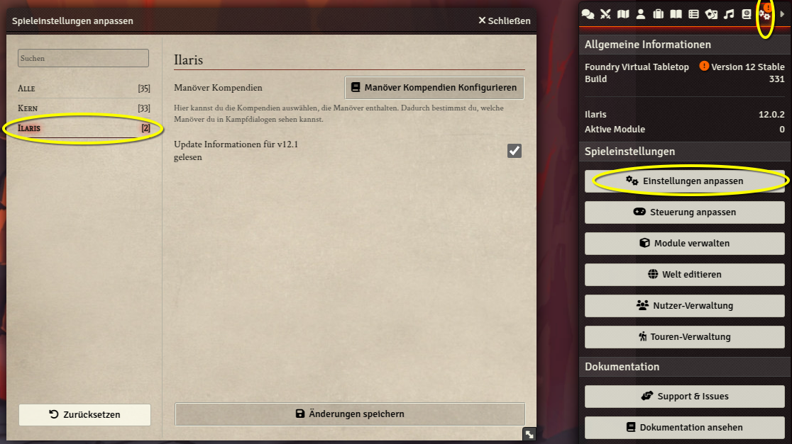

# Anpassungen

## Welteneinstellungen

Einige Welteinstellungen können nur von der SL gesetzt werden und tauchen im Einstellungsdialog
für Spielerinnen garnicht auf. Sie lassen sich über den letzten Tab in der Seitenleiste öffnen.

-   **Platzbedarf berücksichtigen**: Platzbedarf ist eine Hausregel aus Ilaris Advanced. Ohne Haken wird der Platzbedarf nicht angezeigt und in Berechnungen als 0 angenommen. Änderung dieser Einstellungen benötigt einen Neustart von Foundry
-   **Echte Patzer und Krits** (persönliche Präferenz der Entwickler): Die Worldsetting ist für alle gedacht, die es nicht mögen, dass eine 1 kein Patzer ist, weil die Probe mit einem Würfelwurf von 1 gelungen wäre oder es kein Krit mit 20 ist, weil die Probe mehr als eine 20 benötigen würde.
-   **Energiekosten-Einstellung einschränken**: Wenn aktiviert, können Energiekosten nur bei Unitatio-Vorteil oder nicht-numerischen Kosten gesetzt werden. Wenn deaktiviert, können Energiekosten immer manuell gesetzt werden.
-   **Charakter-Synchronisation Button ausblenden**: Als Option, wenn man seinen Charakter nicht über den Sync-Button updaten will. Wenn aktiviert, wird der Button "Charakter mit Kompendium-Vorteilen Synchronisieren" auf dem Heldensheet ausgeblendet.
-   **Scene-Umgebungseinstellungen verwenden**: Wenn aktiviert, werden Licht und Wetter aus den Scene-Einstellungen automatisch in Fernkampf-Dialogen vorausgewählt. Die Umgebungsbedingungen können direkt im Szene-Config Menü gesetzt werden.
