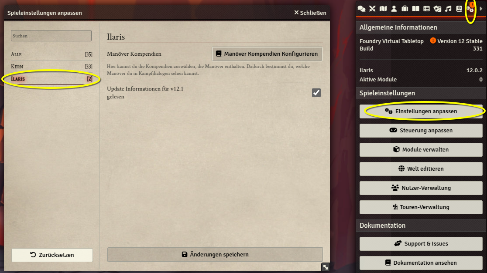

# Anpassungen

## Welteneinstellungen

Einige Welteinstellungen können nur von der SL gesetzt werden und tauchen im Einstellungsdialog
für Spielerinnen garnicht auf. Sie lassen sich über den letzten Tab in der Seitenleiste öffnen.

- **Platzbedarf berücksichtigen**: Platzbedarf ist eine Hausregel aus Ilaris Advanced. Ohne Haken wird der Platzbedarf nicht angezeigt und in Berechnungen als 0 angenommen. Änderung dieser Einstellungen benötigt einen Neustart von Foundry
- **Echte Patzer und Krits** (persönliche Präferenz der Entwickler): Die Worldsetting ist für alle gedacht, die es nicht mögen, dass eine 1 kein Patzer ist, weil die Probe mit einem Würfelwurf von 1 gelungen wäre oder es kein Krit mit 20 ist, weil die Probe mehr als eine 20 benötigen würde.
- **Energiekosten-Einstellung einschränken**: Wenn aktiviert, können Energiekosten nur bei Unitatio-Vorteil oder nicht-numerischen Kosten gesetzt werden. Wenn deaktiviert, können Energiekosten immer manuell gesetzt werden.
- **Hexagonale Token-Bilder**: Wenn aktiviert, werden Charakterbilder auf Hexfeld-Karten als Hexagone zugeschnitten. Dies verbessert die visuelle Darstellung von Token auf Karten mit Hexfeld-Gittern, indem die Token-Bilder an die Form der Hexfelder angepasst werden.
- **Charakter-Synchronisation Button ausblenden**: Als Option, wenn man seinen Charakter nicht über den Sync-Button updaten will. Wenn aktiviert, wird der Button "Charakter mit Kompendium-Vorteilen Synchronisieren" auf dem Heldensheet ausgeblendet.

### Automatisierung

- **Scene-Umgebungseinstellungen verwenden**: Wenn aktiviert, werden Licht und Wetter aus den Scene-Einstellungen automatisch in Fernkampf-Dialogen vorausgewählt. Die Umgebungsbedingungen können direkt im Szene-Config Menü gesetzt werden.
- **Zielauswahl-System verwenden**: Wenn aktiviert, werden in Kampfdialogen die Zielauswahl-Funktion und automatische Verteidigungsaufforderungen angezeigt. Dies ermöglicht es, Ziele für Angriffe auszuwählen und sendet automatisch Verteidigungsprompts an die angegriffenen Akteure. Bei Fernkampfangriffen können Ziele mit Schilden oder durch Ausweichen mit Akrobatik verteidigen.

### LLM / KI-Einstellungen

Diese Einstellungen ermöglichen die automatische Generierung von Pre-Effects für Zaubersprüche über eine KI-API.
Die Einstellungen sind **lokal** — sie werden nur im Browser der SL gespeichert und nie mit der Welt synchronisiert.
Nicht-SL-Spieler:innen sehen diese Felder nicht.

- **LLM API URL**: Die URL des OpenAI-kompatiblen Chat-Completions-Endpunkts. Unterstützte Anbieter:

    | Anbieter       | URL                                             | Modell-Beispiel |
    | -------------- | ----------------------------------------------- | --------------- |
    | OpenAI         | `https://api.openai.com/v1/chat/completions`    | `gpt-4o`        |
    | OpenRouter     | `https://openrouter.ai/api/v1/chat/completions` | `openai/gpt-4o` |
    | DeepSeek       | `https://api.deepseek.com/v1/chat/completions`  | `deepseek-chat` |
    | Ollama (lokal) | `http://localhost:11434/v1/chat/completions`    | `llama3`        |

- **LLM API Key**: Der API-Schlüssel für den Dienst. Wird als Passwort-Feld maskiert und nur im Browser gespeichert.
- **LLM Model**: Das zu verwendende Modell (z.B. `gpt-4o`, `deepseek-chat`).

Nach der Konfiguration erscheint ein "🤖 Generieren"-Button im Pre-Effects-Bereich von Zaubersprüchen,
der eine Anfrage an die KI sendet und die Antwort als Pre-Effect-Konfiguration übernimmt.
